#
##
### before we begin...

This Presentation summarizes all the power efficiency techniques described in ---

- [**"Stefanos Kaxiras; Margaret Martonosi, _Computer Architecture Techniques for Power-Efficiency_, Morgan & Claypool, 2008."**](https://ieeexplore.ieee.org/document/6812802)

. . .

Footnotes[^foot] contain the details (section and page number) of where a topic is described in detail in the reference book.

. . .

Many portions are **skipped**[^sake-comp]... (as topics seemed too hard or irrelevant)
Pointing to appropriate sections to refer to for further details.

[^sake-comp]: This is done for the sake of completion.
[^foot]: This is a footnote.

# Introduction

## The Power Problem

::: columns
:::: {.column width="65%"}

>- Power Consumption and Power dissipation are becoming a major design constraint
  especially when the semiconductor chips are becoming smaller and faster.

>- Earlier the transistors size was large and design complexity/ performance requirement
  were low; which allowed architects to ignore the power aspects of design.

>- This ignorance was further prolonged due to introduction of CMOS which had low power consumption
  than the BJT devices (because CMOS consume power only at switching transistor).

::::
:::: {.column width="35%"}

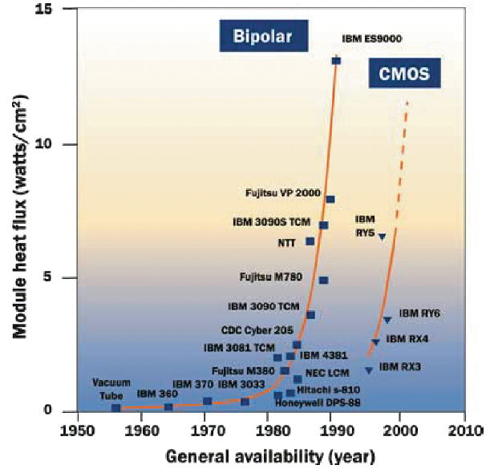{ height=50% }

::::
:::

. . .

Power[^power-prob] is majorly divided into these major categories:
    
  1. **Dynamic Power**
  2. Leakage Power  
  3. Glitching Power  
  4. Others

[^power-prob]: Brief History of the “power problem” --- Section 1.1, Page 1.

## Dynamic Power

The dominant power consumption lies in this category (dynamic), the general formula[^power-formula]
is given by:

\Huge
\begin{equation*}
\boxed{Power  \propto   C V^{2} A f}
\end{equation*}

[^power-formula]: Dynamic Power --- Section 1.2.1, Page 3.

### Capacitance *(C)*

\begin{equation*}
\large
\boxed{Power  \propto   Capacitance}
\end{equation*}

>- Load Capacitance largely depends upon the wire length of on-chip structures.

>- Architects can modify this metric in several ways:
  >+ *For Ex:* Instead of designing one large monolithic processor, we can build
     4 small ones, so that the Average wire length in design is reduced.
  >+ Caches can be designed such that they use multiple cache banks to provide the
     intended operation and maintaining the overall capacitance of such structures.

### Voltage *(V)*

\begin{equation*}
\large
\boxed{Power  \propto   Voltage^{2}}
\end{equation*}


> - The Voltage or V-dd majorly depends upon the Technology Generation and
    is a very important factor in power consumption.

> - Techniques such as ***DVFS*** discussed later, dynamically reduce the operating voltage
    of certain components on chip to reduce the power consumption.

### Activity Factor *(A)*

\begin{equation*}
\large
\boxed{Power  \propto   A}
\end{equation*}

> - The value of Activity Factor lies between 0 and 1, that refers to how often the
    wires relatively transition from 0 to 1 and 1 to 0.
> - Clock wires has Activity Factor as 1, but most other wires in design has activity
    factor below 1.

. . .

Techniques such as **Clock gating** are used to reduce the activity factor by *ANDing* the clock
with a control signal during the IDLE time/period of hardware components.


### Clock Frequency *(f)*

\begin{equation*}
\large
\boxed{Power  \propto   f}
\end{equation*}

> - Directly influences power dissipation, higher frequency leads to more transistor
    switching over a period of time, thus more power consumption.

> - But also to maintain Higher clock frequency it may require (in part) maintaining a
    Higher supply voltage. Thus the Voltage has cubic relationship with power.

. . .

Techniques such as Dynamic Voltage and Frequency scaling reduces \(V,*f* \) at
instances when a lower performance is acceptable.


## Leakage Power

> - Leakage Power[^leak-power] is now increasingly prominent, nearly 20% power lies in this categories
    in current design. It is poised to increase in future.

> - The major reasons for leakage power is gate-leakage and sub-threshold leakage.

> - Sub Threshold leakage power is represented by power dissipated by a transistor
    whose gate is intended to be `off`. Ideally the transistor work as a switch, but
    in reality a sub-threshold current flows when the transistor is deemed `off`.

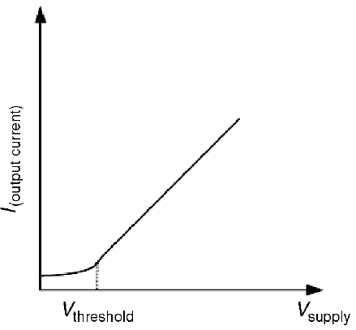{ height=45% }

[^leak-power]: Leakage --- Section 1.2.2, Page 4.

## Power Aware Computing

> - High need of Power aware compute today, data-centers spend billions on the electricity
    and cooling costs.

> - Longer battery life requirements of mobile/IoT devices have further caused architects
    to consider the Power as first order constraint in design.

> - This needs the SoC designs to be thought in terms of Power from the start of
    the design cycle, and appropriate power reduction techniques be applied.


# Modeling, Simulation and Measurement

## Power Metrics

Power metrics[^power-metric] are essential in comparing the gains achieved by implementing different techniques.
Also discussed are best practices regarding when to use them.

. . .

#### **Energy**

Energy, in Joules is the most fundamental possible metric and is widely used in mobile platform,
where energy usage is close to battery life. It issued as an Absolute metric to compare Power
Consumption across designs.

. . .

#### **Power**

Power is rate of energy dissipation, Unit of Power is Watts (W) Joules per second.
It is used to understanding current delivery and Voltage regulation on chip.
It is also widely used in thermal studies. And chip Power consumption is represented
in Watts

[^power-metric]: Metrics --- Section 2.1, Page 9.

--------------------------------------------------------------------------------

#### **Energy-per-Instruction**

Focusing solely on energy may not be enough, *Example:* Reducing Power at expense of
lower performance may not be acceptable. Thus metric which combine energy and performance
have been proposed.
EPI (**Energy-per-Instruction**) is reffered to as method of comparing energy optimizations,
and focus on micro-arch traits, rather than an particular application.

. . .

#### **Energy-delay-product**

Many scenarious where there is requirement of lower power consumption and faster runtime.
With dual goal, EDP (**energy-delay-product**) was proposed as a useful metric.
It offers equal weight to both Energy and Performnace degradation. If either the energy
or delay increase EDP will increase. 

. . .

```
Delay = runtime
Energy = Watts x runtime
EDP = Watts x runtime x runtime
runtime = Instruction Count / MIPS
EDP = Watts x (ICount / MIPS)^2
EDP = ICount^2 x 1/(MIPS^2/Watt)
```

--------------------------------

#### **Energy-delay-squared** and others

Is used where the perfromance improvement matter more than energy consumption.
Other metrics such as ED^3P (**energy-delay-cubic-product**) are also used.

We will not dwell further into this.

. . .

#### Performance and Power Trade-Off Curve

![Performance Power Trade Off curve[^perf-power-curve]](./figs/perf-power-curve.png "Optional title"){ height=50% }

[^perf-power-curve]: Metrics --- Section 2.1, Page 11.

## Power Modeling

### Dynamic modeling

- Empirical Values[^leak-model] based Models which scale to some value range.

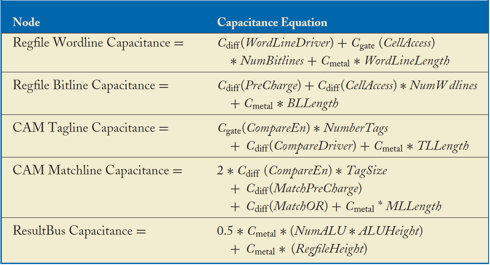{ height=70% }

[^leak-model]: Leakage Models --- Section 2.2.2, Page 13.

### Thermal Modeling

>- A cyclic relationship[^thermal-models] exists between power dissipation and Temperature.

>- Power dissipation results in heat, and heat flows through region based on their
   thermal resistance (R); increasing temperature, thus leakage current and Power dissipation.
   **(A Positive feedback cycle)**

>- HoTSpoT (by Skadron) approach uses a compact RC model for localized heating in high end
   microprocessor.

<!-- >- Well will probably use a PrimePower tool based approach to get Power Numbers. -->

[^thermal-models]: Thermal Models --- Section 2.2.3, Page 15.

### Measurement

Skipped[^measurement]...

[^measurement]: Measurement --- Section 2.4, Page 18.


# Reducing Capacitance and Switching Activity

## Introduction

Architecture and Micro-architecture exert fundamental influence on both
**capacitance** and **switching activity**. High ILP (Instruction Level
Parallelism) generally increases these factors.

. . .

>- The size of processor's structure and how well it is organized to exploit
    locality (for ex: whether functional unit are clustered or not), determine the
    number of transistors and interconnect hence affecting capacitance.
>- Architecture techniques try to reduce *excess switching activity*, thus reduce
    *effective switched capacitance*.

. . .

The excess switching activity is categorized into the following categories:

  > 1. **Idle Unit** *switching activity*
  > 2. **Idle Width** *switching activity*
  > 3. **Idle Capacity** *switching activity*
  > 4. **Parallel** *switching activity*
  > 5. **Cacheable** *switching activity*
  > 6. **Speculative** *switching activity*
  > 7. **Value Dependent** *switching activity*


## Idle Unit

### Clock Gating

The excess switching[^clk-gating] activity triggered by clock fed to logical units
(*idle*), which does nothing useful with respect to computation being performed.
This type of excess activity appears at different granularity from individual
flip flop to whole functional unit/subsystem.

[^clk-gating]: Circuit-Level Basics --- Section 4.2.1, Page 52.

. . .

#### Basic Clock Gating

::: columns
:::: {.column width="60%"}

Clock Gating reduces power by preventing unnecessary charging and discharging of circuit capacitance's.

> - Using an **AND** gate to gate the clock with a control signal, we replace
    the capacitance of flip flop with
    that of **AND** gate (capacitance of **AND** gate is much lower than of Flip Flop)

::::
:::: {.column width="40%"}

. . .

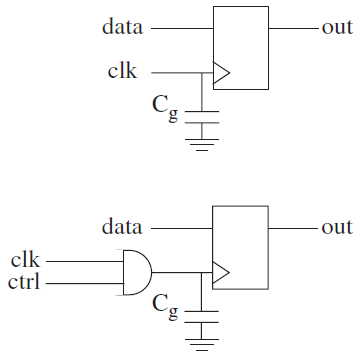{ height=50% }

::::
:::


----------

#### **Logic Gating**

For Static logic, to eliminates switching it is enough to prevent inputs from changing.
This is done by clock gating input flip flops. 

. . .

However in Dynamic logic (most of logic in Processor Core), power can be consumed even when
inputs do not change.

. . .

::: columns
:::: {.column width="60%"}

. . .

> In dynamic logic the output is pre-charged to ***Vdd*** and a pull down network can discharge the
> output node to ***GND*** if needed. So if some logic function evaluates to zero, output node will
> charge discharge every cycle even with constant inputs. 

::::
:::: {.column width="40%"}

. . .

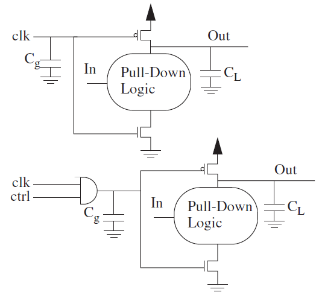{ height=60% }

::::
:::

------------------------------------------------------

#### **RTL Transformations**

Clock gating is applied at RTL level, with transformations on un-optimized designs.

. . .

  - For Example in flip-flops where the input is guarded by a condition it can be used to
    gate the clock instead. When such a flip-flop is part of pipelined design the same
    condition can be propagated to further pipeline stages using "**always on**" latches.

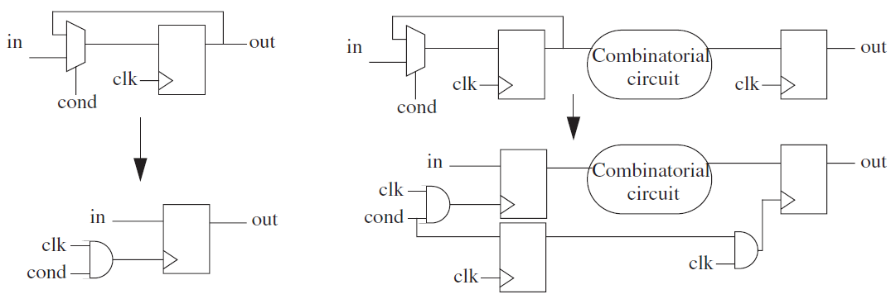{ height=55% }

. . .

> *All such transformation are routinely applied by all major RTL compilers*


### Pre-computation and guarded evaluation

Skipped[^pre-comp] ...

[^pre-comp]: Precomputation and Guarded Evaluation --- Section 4.2.2, Page 53.


### Deterministic Clock Gating

Gating the clock to processors structures[^dcg], when they are known to be IDLE provides
notable power saving without performance loss. It improves the overall EDP of design.

. . .

> Besides the latches, the pipeline stages (dynamic logic) must also be clock gated.

. . .

::: columns
:::: {.column width="40%"}

  > - *DCG stems from the ability to deduce a few cycles in advance the idleness of a latch
       or pipeline stage.* 
  > - *This information is carried to further stages using always clocked
       latches.*

::::
:::: {.column width="60%"}

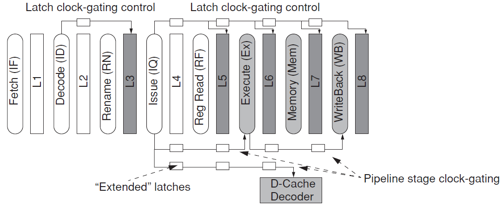{ height=50% }

::::
:::


[^dcg]: Deterministic Clock Gating --- Section 4.2.3, Page 54.

------------------------------------------------------------------------

{ height=60% }

  >- Fetch Stage and Decode Stage latches are never clock gated, as instructions
     are needed every cycle.
  >- Decode stage information can be used to clock gate upto Issue stage.
  >- From Issue stage the information to gate stage and latch is passed along with always
     on latches (ALU, FPU, MUL/DIV Data Cache port etc.)
  >- Load Store Instruction determine the clock gating for Data Cache, Cache Port
     the dynamic logic of decoder and wordline drivers are always clock gated.


### **Power5 IBM**, _Clock gating Example_

Dynamic Clock Gating is extensively used in IBM processor. According to IBM[^p5-ibm] use of
clock gating yields a reduction in switching power by **more than 25%** without affecting
performance and frequency.

. . .

  > - The larger the Unit that is clock gated, the more likely it is to cause ***di/dt***
      problem, *i.e.* large current swing in power rails when clock is reinstated.
  > - POWER5 implements _fine grain gating domains_ to reduce noise.
  > - All clock gating events are programmable, allowing extensive control over gating.
  > - There are both global and local clock gating enable signals, but actual gating decision is taken
      by logic dedicated to each gated unit. The logic generates a _dynamic stop signal_.

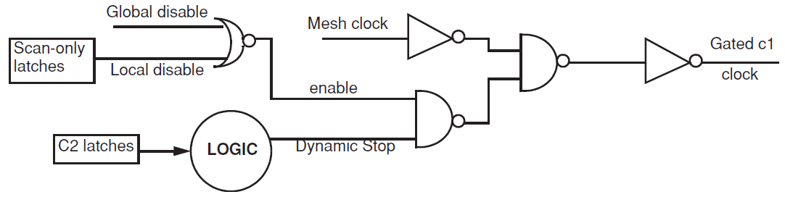{ height=35% }

[^p5-ibm]: Clock gating examples --- Section 4.2.4, Page 56.

## Idle Width -- Core

### Introduction --- Idle Width Switching Activity

**Idle Width Switching Activity**[^iw-sa] is excess Switching Activity arising from mismatch between
designed bit-width of machine (processor) and actual bit-width needed in frequently
occurring operations.

. . .

The main approaches to remove such kind of switching activity is to dynamically
detect narrow width operand and to either adapt the width of machine accordingly
or pack multiple narrow width operands together.

. . .

> SIMD (Single Instruction Multiple Data) ISA pack multiple sub-word operands in
> width of machine and execute them in parallel.

[^iw-sa]: Idle-width Switching Activity --- Section 4.3, Page 58.

### Narrow Width Operands

Most of the times the Processor width is over-provisioned 64-bit for most operations
and some portion of data path remains unused.

. . .

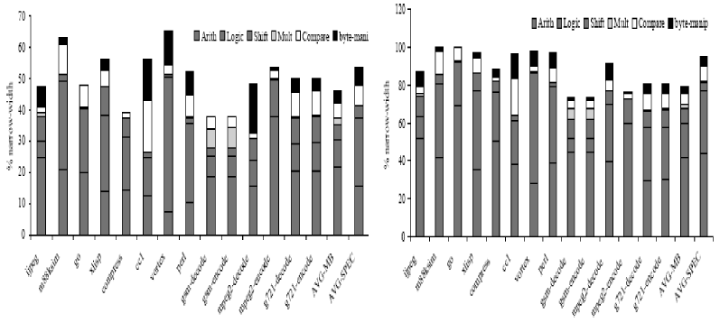{ height=40% }

. . .

For SPECint95 & mediabench more than 50% of operations have both operands as narrow[^nw-operands]
(less than 16-bit), very few operations have operands wider than 33-bit.
This can be exploited in 2 ways:

. . .
  
  > 1. By disabling unused width of hardware and eliminate switching.
  > 2. Packing multiple narrow width operand in full width of machine. *(improves EDP)*


[^nw-operands]: Narrow-WidthOperands --- Section 4.3.1, Page 59.

----------

#### Dynamically Detecting Narrow Width Operands

  - Anything less than 16-bit is considered as narrow
  - Anything larger is taken as full 64-bit 


Other partitions can also be made similarly.

. . .

> Every value created in ALU or loaded from cache is checked for effective size.
  If 48 of leading bits are zeros or ones, the value can be represented using just
  about 16-bits.

. . .


It is tagged as *narrow width* using a single bit and the tag follows throughout
the machine (pipeline).


### Value Gating - Disabling Unused Width

Disabling Unused portion of ALU[^value-gate] (Adder, Comparator), if both operands of
an operation are tagged narrow.
*Potentially part of ALU can safely be disabled when the operations are narrow.*
This ensures no switching  occurs in unused portion of ALU (for static logic)

. . .

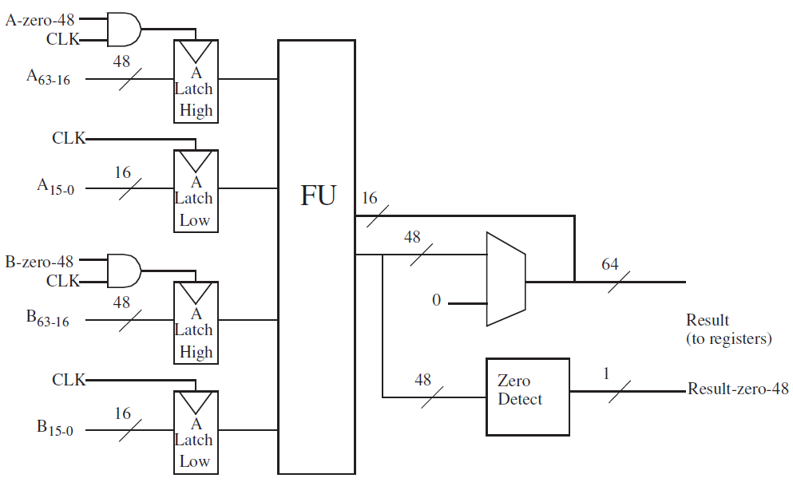{ height=55% }

. . .

**55%-58%** reduction in power consumption of integer unit for SPECint95 and mediabench
benchmarks.

[^value-gate]: value gating --- Section 4.3.1, Page 60.


### Operation Packing

In this technique[^op-pack] two similar operations, with narrow width operands are simultaneously
issued to a single full width ALU.
This can increase performance if there is contention for ALU without the power overhead
(since switching remains same). Improves EDP.

. . .

#### How it Works ?

  > - Issue logic detects 2 instructions performing same operation and has narrow width operands.
  > - A set of multiplexer is used to shift the significant part of operands into higher order
      bits of an ALU, other instructions operands into lower order bits of ALU. 
      The ALU executes in SIMD mode.

. . .

{ height=30% }

. . .

> ALU needs to segment carry chain at 16-bits (Some logical changes are required in ALU)

[^op-pack]: Operation Packing --- Section 4.3.1, Page 61.

### Significance Compression

Insert Table 4.2


## Idle Width -- Caches

### Introduction --- Idle Width -- Caches

  > - Power can be saved by accessing only the significant or the compressed part of the word.
    This results in reading and writing fewer bits and corresponds to clock gating unused
    path of ALU or datapath.
  
  > - Alternatively, multiple cache lines can be compressed and packed in space of uncompressed line.
    This improves performance of cache and corresponds to dynamic packing of narrow width operands.

. . .

The major schemes[^idle-width-cache] are:
  
 > - Dynamic Zero Compression
 > - **Frequent Value Cache**
 > - Compression Cache
 > - Significance Compression

[^idle-width-cache]: Idle Width Switching Activity: Caches --- Section 4.4, Page 64.

### Dynamic Zero Compression

Skipped[^dzc] ...

[^dzc]: Dynamic Zero Compression --- Section 4.4.1, Page 65.

### Value Compression

#### *Frequent Value Locality*

  > - In a program a small number of distinct values often account for large portion
    of value stream that is accessed. *i.e.* small number of distinct values make 
    major portions of memory accesses. 

  > - This set of frequently occurring value changes slowly during execution of a program.
  
  > - Frequent value based techniques tends to increase effective capacity of L1 Cache by
    packing more compressed cache line in cache and reduce power and reduce power
    consumption by accessing fewer bits.

. . .

#### *Frequent Value Compression*

  > - In Frequent Value Compression a dictionary is loaded with frequent values of a program.
  
  > - Every occurrence of frequent values in cache is then replaced by an index to actual value in dictionary.
  
  > - Typical frequent values include **0, 1, -1** and some program specific values Ex. Perl uses **0x78787878** frequently.
    Frequent values are loaded in dictionary by profiling the program beforehand, dynamically loading
    the dictionary is also proposed. 

  > - Just **8** frequent values make **48%** of memory access in several SPEC2000 benchmarks  


### Frequent Value Cache

 > - A Cache line can contain both compressed and un-compressed values. Their status is
    determined by additional bits added in Tag RAM
 > - A compressed word is simply an *index*[^fvc] to the dictionary, the index occupies lower
    8-bits and the rest of cache line is unused.
 > - These 8-bit make an index to a 256 value dictionary.

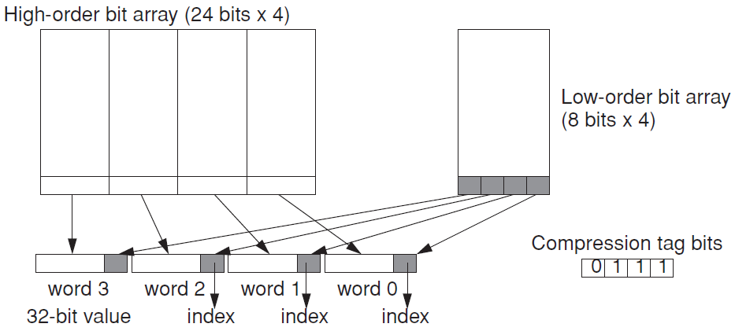{ height=50% }

[^fvc]: Frequent value cache --- Section 4.4.2, Page 66.

--------------------------------------------------------------------------------

#### How does a Frequent Value Cache Work ?

  >- The cache is split into two different data arrays (8-bit, 24-bit).
  >- Initially only Tag (along with compressed bit) and 8-bit RAM is accessed, thus
    only compressed word or lower 8-bit of uncompressed word is accessed.
  >- If it is a compressed words the lower 8-bits are index to dictionary,
    which is accessed next and value is retrieved.
  >- If it is uncompressed, the rest 24-bits are accessed in the subsequent cycle. *(performance reduction)*

<!-- { height=30% } -->

. . .

> This type of arch. resulted in 3% increase in execution time of SPEC95 benchmark, but at the same time
> a 29% reduction of energy for a 64KB L1 I-Cache

. . .

> *The energy reduction comes from efficiently accessing compressed values, the cost of accessing smaller
   8-bit RAM plus the cost of accessing dictionary is lower than cost of accessing full cache line.*


### Packing Compressed Cache Lines

FVC saves power by solely by accessing fewer bits for compressed items. In the case
the space freed by compression simply remains empty in the cache. This empty space
is exploited by squeezing more than one compressed line[^compressed-c] in cache frame.

This increases cache utilization and saves power by reducing the number of accesses to
lower level of memory.

#### Implementation

**Compression Cache and Significance Compression Cache** are packing techniques
which attempt to pack multiple cacheline into frames.

Skipped ...

[^compressed-c]: Compression Cache --- Section 4.4.3, Page 69.


### Instruction Compression

Similar to data, instruction also exhibit locality: a small number of instruction appear
quite frequently in dynamic instruction stream.

. . .

80% of dynamic stream in MiBench can be easily captured with 64 different static instructions
these can be stored in a Dictionary[^inst-compression] called Instruction register File (IRF) --- Similar
to frequent value Cache.

. . .

All instances of these instructions are replaced by dictionary index, resulting in
improved fetch bandwidth and energy savings.

. . .

> **Instruction fetch Energy reduction can reach upto 37% for MiBench**

[^inst-compression]: Instruction Compression --- Section 4.4.4, Page 70. 


## Idle Capacity Switching Activity -- Core

Skipped[^3] ...

[^3]: Section 4.5, 4.6, 4.7

## Idle Capacity Switching Activity -- Cache

### Introduction

Caches can also be dynamically resized to meet the program needs and remaining
of their portions can be turned off.

. . .

Three techniques[^idle-cache] are discussed:

  > 1. **Cache Resizing** to Trade memory between two levels.
  > 2. **Selective Cache Ways**
  > 3. **Accounting Cache** - Combination of above two

[^idle-cache]: Idle-Capacity Switching Activity: Caches --- Section 4.8, Page 84.

### Trading Memory between Cache Levels

A variable division of cache between L1 and L2 [^trade-l1-l2]. This dynamic division is based on assigning
memory segments to either L1 and L2.
The caches are resized by increasing or decreasing the associativity, not changing the number
of sets.

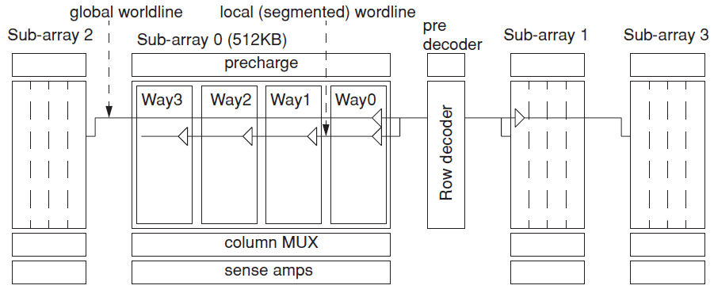{ height=45% }

Making L1 smaller allows for faster clock (the latency of cache in cycle does not change),
while making it large increases its hit ratio.
Power gains can be made by creating appropriate distribution between L1 and L2.


[^trade-l1-l2]: Trading Memory between Cache Levels --- Section 4.8.1, Page 86.

### Selective Cache Ways

The idea of selective cache ways is rooted in two observations:

  > 1. First, not all cache is needed all the time for a program i.e. small cache
       does almost as well a job as large caches.
  > 2. Resizing the cache configuration can be done without degrading frequency.

. . .

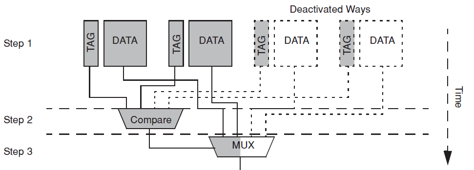{ height=35% }

. . .

Disabling a cache way means the data array does not react to cache accesses, the Tag rams remain active.

  > - Its bit-lines are not pre-charged
  > - Word-lines are not active
  > - Sense amplifier are prevented from firing

------------------------------------------------------

#### What happens to modified dirty data.

Data in disabled way can be accessed briefly reinstating it into active status.
This happens in two situations:
  
  > - First when coherence request needs data from disabled way.
  > - when there is Hit in disabled way. 

. . .

In both cases, the data is moved out of disabled way --- temporarily enabled for this
purpose --- and moved to enable way.

### Accounting Cache

Skipped[^4.8.3] ...

[^4.8.3]: Accounting Cache --- Section 4.8.3, Page 91.


## Parallel Switching Activity

### Introduction --- Parallel Switching Activity

Apart from cache resizing, we can reduce switching on basis of individual
cache.
The parallel search in set-associative cache is prime example of parallel
switching activity[^power-hungry].

. . .

> While it is known beforehand that all but one of the ways will fail to produce the
  *Hit*, all ways are still accessed in parallel for speed.

. . .

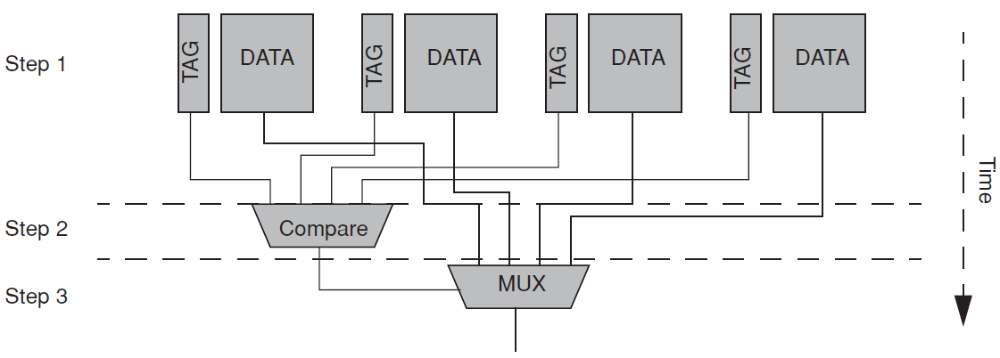{ height=40% }

. . .

*In Power challenged incarnation of set associative cache, power is linear to its associativity*

[^power-hungry]: Parallel Switching Activity in Set-Associative Cache --- Section 4.9, Page 97.

### Phased Cache

In this technique[^phased-cache] to reduce switching activity data ram is not accessed until a
hit is determined. Then only the Data Ram of way which was hit is accessed.

. . .

As the name suggests the data is accessed in two phases: Tag and Data Phase.

. . .

::: columns
:::: {.column width="60%"}

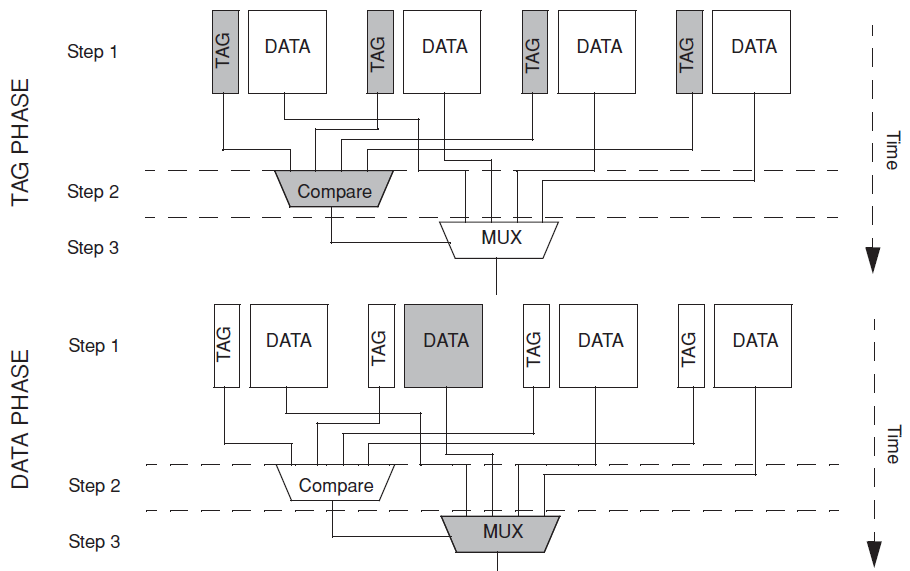{ height=60% }

::::
:::: {.column width="40%"}

Power consumed in new data access is given by:

. . .

\begin{equation*}
\boxed{Pnew  =   P \times \frac{(1 - miss\_ratio)}{Ways}}
\end{equation*}

. . .

> Was implemented in L2 of Alpha 21264 and SH3 (Hitachi Low Power embedded Processor)

::::
:::

[^phased-cache]: Phased Cache --- Section 4.9.1, Page 98.

---------------------

{ height=50% }

#### Performance Cost of a Phased Cache

  - This type of architecture costs the performance due to larger latency as Data
    access cannot hide behind the Tag Comparison.

  - The performance cost is significant only if performance is strongly dependent upon
    latency. *Ex:* For non-pipelined L1 cache and in-order cores this could degrade 
    performance


### Sequentially Accessed Set Associative Cache

In this technique[^seq-accessed] only the most likely cache way is probed first.

::: columns
:::: {.column width="40%"}

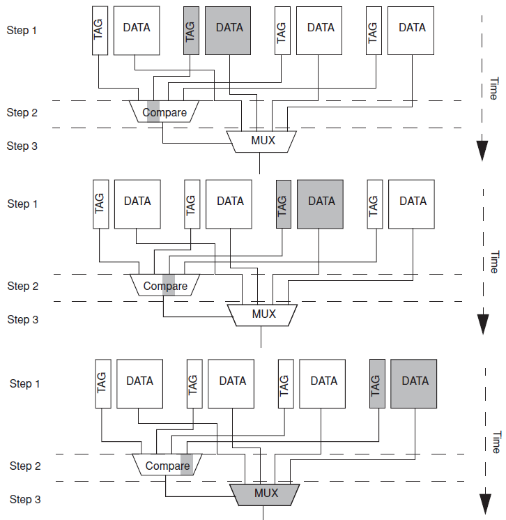{ height=70% }

\vspace{-0.1in}

::::
:::: {.column width="60%"}
  
> - The first probe is chosen according toMRU way.
> - On a miss, a sequential search of all remaining ways is performed.
> - If cache implements true LRU scheme, the MRU information to select a way
    can be extracted from LRU.

. . .

> Depending upon the prediction accuracy a lot of power can be saved, but at the same
> time if accuracy is low it can hinder performance significantly due to sequential search.

. . .

\smallskip

**NOTE:** Earlier related work was a Hash-Rehash cache, that converts direct mapped cache
to 2-way set associative cache by mapping conflicting lines on 2 separate sub banks.

::::
:::

[^seq-accessed]: Sequentially Accessed Set Associative Cache --- Section 4.9.2, Page 99. 

\blfootnote{Hash-Rehash Cache Pseudo-associativity --- Section 4.9.2, Page 100.}

<!-- [^hash-rehash]: Hash-Rehash Cache Pseudo-associativity --- Section 4.9.2, Page 100.  -->

### Way Prediction

In Way Prediction[^way-p] a separate prediction structure is employed to hold MRU information
--- for each cache set a bit map points the MRU way with a set bit.

. . .

This structure is accessed prior to accessing a cache, using the requested address (or part of)
and provide prediction where the requested data are likely to be found.

. . .

::: columns
:::: {.column width="50%"}

  > - Initially, only the predicted way (both Tag and Data arrays) is accessed.
  > - Tag comparison determines a Hit or a miss, on a miss remaining ways are accessed in
      parallel, to determine if requested data exist in MRU positions.

::::
:::: {.column width="50%"}

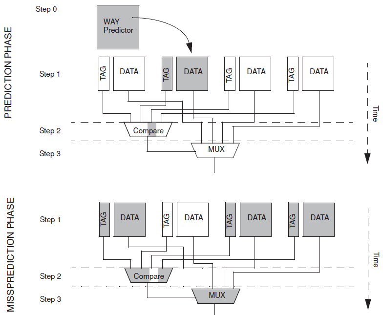{ height=60% }

\vspace{-0.1in}

::::
:::


[^way-p]: Way Prediction --- Section 4.9.3, Page 101.

-----------------------------------------

### Hybrid Way Prediction

Other techniques[^hybrid-wp] like Phased Cache or Sequentially accessed cache can be merged
with Way Prediction.

. . .

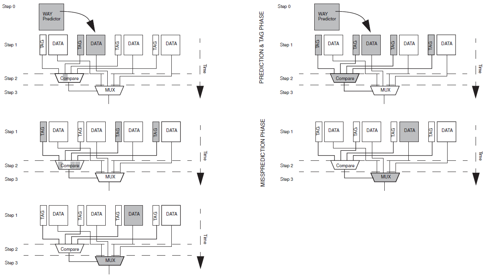{ height=70% }

[^hybrid-wp]: Hybrid Way Prediction --- Section 4.9.3, Page 103.

### Advanced Way Prediction

Skipped[^adv-wp] ...

[^adv-wp]: Advanced Way Prediction Mechanisms --- Section 4.9.4, Page 104.

### Way Selection

*Way Prediction* techniques have the disadvantage of second probe on mispredictions.
The second probe costs both latency and power. In OoO processor it may even interfere
with scheduling.

. . .

**Way Selection** techniques completely remove the need of prediction, by implementing
techniques guaranteed to open correct way while accessing cache.

Two techniques of Way Selection are discussed:

. . .

 > 1. Location Cache[^loc-cache]
 > 2. Way Halting Cache

. . .

#### **Location Cache**

The location cache (LC) as the name implies, stores position (way) of cache line in L2.

  > - The LC sits next to L1 and there is ample time to access it before accessing L2.
  > - On a miss in L1, the LC supplies a way number for L2 and only that way is accessed.
  > - If there is a miss in LC the L2 is accessed as ordinary set associative cache.
  > - When updating the Cache Line in L2, the LC cache is stored with the corresponding
      Way Location.

[^loc-cache]: Location Cache, Way Selection --- Section 4.9.5, Page 107.

### Way Halting Cache

Way halting[^way-halt] deterministically accesses only the correct way.
It works by halting the parallel access to all irrelevant ways, once a hit
and it's location is determined in Tag Comparison. 

. . .

> - Tag Comparison needs to be fast, so a partial tag match in CAM structure is performed.
> - This makes it fast enough for its outcome to gate Tag and Data wordlines driven by
    index decoder.
> - The access to ways is halted by not driving their respective wordlines.

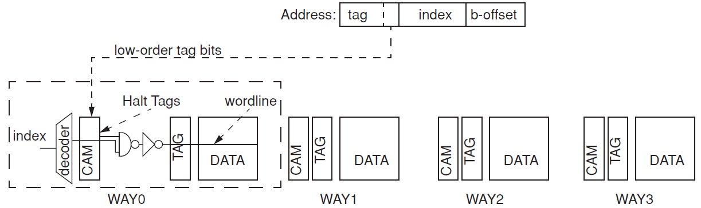{ height=35% }

. . .

> Way halting cache reduce energy in a 4-way set associative cache from **45% to 60%**
> with a slight **area overhead of 2%** and **no performance penalty !**

\vspace{-0.1in}

[^way-halt]: Way halting cache, Way Selection --- Section 4.9.5, Page 108.


## Cacheable Switching Activity

### Introduction --- cacheable switching activity

An important switching activity that can be avoided to reduce the power is
repetitive computing activity.[^cache-switch]
In reality the computing activity is converted to caching activity.

. . .

This is achieved by storing the results of computation and recognizing when it
repeats, producing same results.

. . .

> *This can save considerable power if the difference in energy between accessing the
> cache and re-computing is quite large.*

#### **Computation**

Repetitive computation, while executing a program appears at many levels:

. . .

  > - Functional Unit (Multiplier, FPU fed same operands)
  > - Instruction Level (Some repeating instruction)
  > - Basic Block Level (repeating loop iterations)

. . .

Such Computation, when used with exact same input, produces the same result
and therefore can be cached.

[^cache-switch]: Computation, Cacheable Switching Activity --- Section 4.10, Page 110.

-----------------------

### Cache Hierarchy

Cache Hierarchy[^cache-hier] itself being a performnace optimization is also a Power
Optimization, in a sense that it steers majority of accesses to small power
efficient (lower capacitance) memory structure.

. . .

Memory Hierarchy is a natural way to minimize switching activity in succesively
larger and more power hungry cache.

. . .

Three Low Power approaches exploit characteristics of cache hierarchy are :

  > - Filter Cache
  > - Loop Cache
  > - Trace Cache

[^cache-hier]: Cache Hierarchy, Cacheable Switching Activity --- Section 4.10, Page 111.

### Work Reuse --- Operational Level

**Memonization[^memo]** is act of remembering the result of an operation in relation to it's input.
A *memo-table* stores the operands, operation and the result (for ex: FPU operations)
Upon seeing the same operands the result is retrieved from Memo-Table and is
multiplexed onto the output.

. . .

  > - The memo-table is initially empty and updated with operands and results during
      normal operation.
  > - Now upon receiving a FPU instruction the memo-table and FPU start operation
      simultaneously.
  > - however, memo-table gives output fast (in single cycle) and if a hit, the remaining
      stages of FPU can be then gated to save power.

::: columns
:::: {.column width="40%"}
. . .

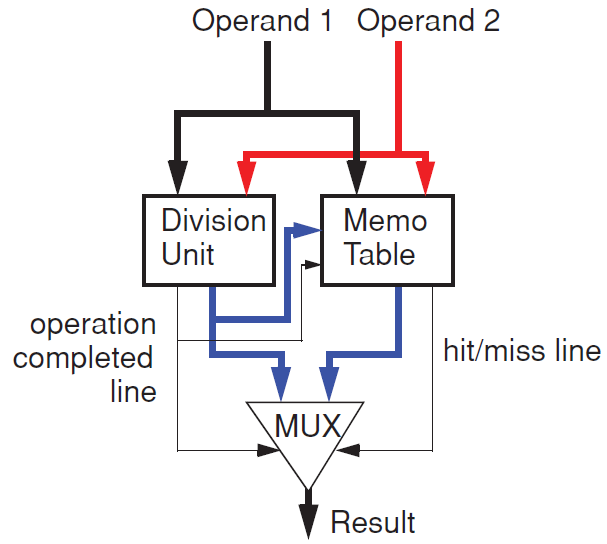{ height=35% }

::::
:::: {.column width="60%"}
. . .

The **Power and Performance** benefits are immense as some FP operation take 15-30 cycles which can
easily can be done in a single cycle using memo-table lookup and avoid switching activity.

::::
:::


[^memo]: Work Reuse, Operation level --- Section 4.10.1, Page 112.

----------------------------

{ height=50% }

. . .

#### Memonization Statistics

Perfect benchmark suite, SPEC FP95 and imaging and DSP applications have:

. . .

  > - **59%** of Integer *multiplies*
  > - **43%** of Floating Point *multiplies* and **50%** of Floating Point *divisions* 

. . .

which are *memoizable* and can be performed in a single cycle with **small**
*(32-entry, 4-way set associative)* memo-table.


### Filter Cache

The filter cache[^filter-c] is a tiny cache (128-256 bytes) that filters the processors
reference stream in a very power efficient manner, trading performance to power
for a better EDP.

. . .

Filter cache sits between Core and L1 cache. The configuration can be set to
default by bypassing the filter cache.

. . .

Filter cache satisfies about 60% of Processor references but remaining that slip
are slower. A filter cache should strike a delicate balance between it's Power
and Performance.

. . .

 > - A very small filter cache can hurt performance *(Low hit rate)*
 > - A very large filter cache can hurt Power *(Capacitance and Switching Activity Increases)*

[^filter-c]: Filter Cache --- Section 4.10.2, Page 114.

### Loop Cache

Loop Cache[^loop-c] is designed to hold small loops commonly found in media and DSP Workload. It
is typically just a piece of SRAM that is software/compiler controlled.

. . .

A small loop is loaded in loop cache/buffer under program control and execution
resumes fetching from loop buffer rather than L1 cache. The loop buffer is very
energy efficient at supplying instructions avoiding L1.

. . .

> The loop buffer caches a small block of consecutive instructions, no tag or
> tag comparison is needed for addressing its contents. Instead relative index
> from start of loop is enough to access all instructions.
> **Lack of Tag and Tag comparison makes it more efficient.** 

. . .

> - Fully automatic loop caches have been proposed, which detect loops at
    runtime.

> - Intel's Core 2 Architecture embeds a loop buffer in Instruction Queue and
    has a *loop stream detector*, that detects loop at runtime and starts fetching
    from IQ without any external fetching.

[^loop-c]: Loop Cache --- Section 4.10.3, Page 115.


### Trace Cache

Skipped[^trace-c]...

[^trace-c]: Trace Cache --- Section 4.10.4, Page 116.

## Speculative Switching Activity

Related to Branch Predictors

Skipped[^spec-sa]...

[^spec-sa]: Speculative Activity --- Section 4.11, Page 117.

## Value Dependent Switching Activity

Related to Address and Data bus encodings

Skipped[^value-sa]...

[^value-sa]: Value Dependent Switching Activity --- Section 4.12, Page 120.


# Dynamic Voltage and Frequency Scaling

## Introduction to DVFS

Deals with reducing the overall power by reducing it's voltage and frequency component. *(V,f)*

\begin{equation*}
\boxed{Power  \propto   C V^{2} A f}
\end{equation*}

. . .

  - If Voltage are reduced then it also slows transistor such that frequency also needed to be reduced.
  
\begin{equation*}
\large
\boxed{Frequency  \propto   Voltage}
\end{equation*}

. . .

\begin{equation*}
\large
\boxed{Power  \propto   Voltage^{3}}
\end{equation*}

. . .

Thus reducing the Voltage and frequency leads to ***cubic*** reduction[^dvfs-intro] in Power but ***linearly*** degrades performance *(f)*.

[^dvfs-intro]: dynamic voltage and frequency scaling --- Section 3.1, Page 23.

## Design Issues in DVFS

#### 1. At What Level DVFS control policies Operate ?

DVFS can be broadly categorized into three levels
  
  > - System Level DVFS
  > - Program Level DVFS
  > - Hardware Level DVFS

. . .

#### 2. How will the DVFS settings be selected and orchestrated ?

  - Software may write a CSR to control the values of *(V,f)*
  - Can be changed by implementing "under the covers" hardware mechanism
    which change the values at appropriate events.

. . .

#### 3. What is hardware granularity at which *(V,f)* are controlled ?

  - In most scenarios the whole Processor Core works at a single *(V,f)* value and is mostly
    asynchronous to outside work. The Processor is often stalled waiting on memory, so reducing
    the supply voltage and frequency will reduce power without having any significant impact on
    performance 


\blfootnote{Design Issues in DVFS --- Section 3.1.1, Page 24}

--------------------------------------------------------------------------------

#### 4. How does implementation characteristics of DVFS affect strategies to employ ?

What is the delay required to engage a new *(V,f)* value and can the core continue to execute during 
this transition?
  
  - If the delay is short, then a dynamic reactive DVFS policy may be implemented.
  - If the delay is large, then a more intelligent offline analysis might be required.

. . .
  
Another question is whether the continuous settings of *(V,f)* pairs are possible, or they can be changed
in fixed, discrete steps.

  - If only fixed, discrete values are available then optimization space becomes difficult to navigate
    (it becomes non-convex), as a result to find global optima offline analysis may be required.

. . .

#### 5. DVFS for Multi-Core Environments

In parallel computing scenario reducing the clock frequency of one thread, may impact the 
other dependent threads that are waiting for result to be produced.

Some notion of software critical path must also be taken into account for such DVFS implementation.


## System Level DVFS techniques

### Introduction to System Level DVFS

One could assume that we can run a core very fast, do the required work and then go in sleep mode.
This would save us power for the IDLE time period.

. . .

> Intuitively it seems correct, but this is false.

. . .

Consider the example that we can finish a work in half time quanta at Max(V,f) and then go in sleep mode.

  > - Rather reducing the frequency (slowing the clock) we can stretch the work to end of time quanta.
  > - The power also reduces to half in this example (similar to being IDLE for half time quanta), but
      we can also scale down the voltage which reduces Power by Cubic factor.

> "Thus more Power is saved by stretching the work to whole time quanta (reducing frequency) and
> also reducing the Operating Voltage."

. . .

All algorithms are interval based namely - OPT, FUTURE, PAST
Time intervals are sampled and then system level (V,f) are modified.

> **We will not go into detail on System Level DVFS.**

\blfootnote{System Level DVFS --- Section 3.2, Page 26.}

## Program Level DVFS

### Introduction to Program Level DVFS

DVFS control is exposed to software level[^dvfs-prog] through instructions that can set values *(V,f)*.
These mode set instructions are available in Processors such as **Intel XScale** and **AMD Mobile K6 Plus**.

. . .

This is largely under control of OS at Process/Task Level, but sometimes code is embedded in application
executable itself.

[^dvfs-prog]: Program Level DVFS --- Section 3.3, Page 29

### Offline Compiler Analysis

If Processor and Memory operate largely asynchronously from each other, then processor can be dialed
down to much lower clock frequency during memory bound regions with considerable energy savings[^dvfs-offline]
and no energy loss.

. . .

#### Profile-assisted compiler approach --- Algorithm

> Given a Program *P*, find a program region *R* and frequency *f* (lower than *f-max*) such that,
> If *R* is executed at a reduced frequency *f* and reduced voltage,
> 
>   - The total execution time (including the *(V,f)* scaling overhead) is not increased more than a
>     small factor over the original execution time.
> 
>   - Total energy usage is minimized.

. . .

> Compiler finds appropriate regions (according to Algorithm ) in a Program and then
> inserts the DVFS control instructions.

[^dvfs-offline]: Offline Compiler Analysis --- Section 3.3.1, Page 29

### Online Dynamic Compiler Analysis

Dynamic compilation technique to analyze program behavior & dynamically insert DVFS adjustment[^dvfs-online].
These methods use a RDO (Runtime DVFS optimizer) analysis during code execution.

. . .

::: columns
:::: {.column width="60%"}

RDO determines if the code is "Hot" (will be executed frequently) or Not and is then taken up for
DVFS optimizations.

. . .

  > - Regions are determined if they are CPU bound or memory bound, If they are memory bound they are
      taken up for DVFS optimizations.
  > - Memory bound code has enough slack, so that slowing it down does not hurt the overall performance
      and can save power.

::::
:::: {.column width="40%"}

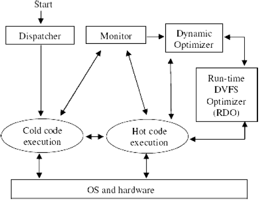{ height=40% }

::::
:::

. . .

#### How

At runtime, analytical model is approximated using Hardware Performance Counters.

. . .

  - They provide information regarding the type of instruction retired (ALU, Memory) and no of bus
    transactions.

[^dvfs-online]: Online Compiler Analysis --- Section 3.3.2, Page 32


### Multi Clock Domain Processors

The rational behind the multi-clock domain processor is that as feature size becomes smaller
it becomes more difficult and expensive to distribute global clock signal with low skew to
processor die.

. . .

Thus *Globally Asynchronous Locally Synchronous*[^dvfs-mcd] architectures were proposed.

. . .

::: columns
:::: {.column width="60%"}

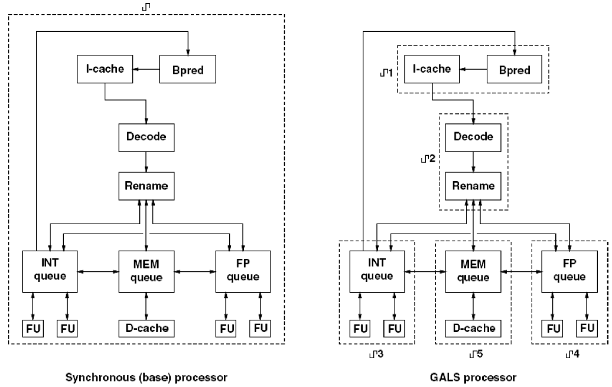{ height=60% }

::::
:::: {.column width="40%"}

In GALS processor core is divided into synchronous island, each connected asynchronously with
additional hardware to avoid meta-stability (synchronizers).

::::
:::

[^dvfs-mcd]: DVFS for MCD Processor --- Section 3.4.1, Page 35.


------------------------------------------

As with other DVFS techniques, the key is to find inter domain slack to exploit.

. . .

*Example:* The FPU could be clocked much more slowly than instruction fetch, because the
throughput and latency demands are low.

. . .

#### Offline DVFS for MCD Processors

Application is executed in simulator and created event trace. These events are then
connected/co-related with resource constraint to find dependencies and switch *(V,f)*
for various clock domains by inserting appropriate Instructions.

. . .

#### Online DVFS for MCD Processors

Significant co-relation between no of valid entries in input queue for each domain
and desired frequency for optimal operation exists.

**Attack / Decay runtime algorithm**

  - Samples of no of entries in queue for each domain are taken at fixed intervals.
  - Then changes are made to each domains *(V,f)*
    + For a particular domain if the number of entries in a queue increases the *(V,f)* should be increased
    + For a particular domain if the number of entries in a queue decreases the *(V,f)* should be decreased


### Dynamic Work Steering - for MCD Processors

In this type of architectures[^dvfs-work-steer], two types of pipelines are implemented:

. . .

::: columns
:::: {.column width="40%"}
  
 > - One Power hungry, faster pipeline.
 > - One Power efficient, slower pipeline.

. . .

> Now the issue is not to utilize the slack, but rather than steer the appropriate instruction to
appropriate pipe (fast/slow).

::::
:::: {.column width="60%"}

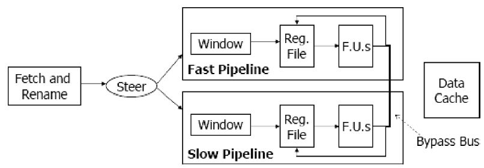{ height=55% }

::::
:::

. . .
  
These techniques work because a significant slack exists, such that many instructions can
be delayed several cycles without any impact on program's critical path.

. . .

> *Slack information is stored in hardware structures. Details skipped for now.*

[^dvfs-work-steer]: Dynamic Work Steering for MCD Processors --- Section 3.4.2, Page 38.

## Hardware Level DVFS

### Razor Flop

The objective is to remove slack in timing of hardware itself, the approach is called *Razor*[^dvfs-razor].

. . .

  > - Going below critical voltage level for a given frequency causes timing faults.
  > - The idea behind *Razor* is to lower the voltage until timing fault occurs.
  > - These faults are detected by the hardware itself using "*safe flip-flops*" that detect timing violation.

::: columns
:::: {.column width="50%"}

> The RAZOR flip flops double smaples pipline stage with fast clock and second with delayed clock.
> The shadow latch always has correct value. 

  - The value of main latch are then compared with metastability tolerent comparator.

::::
:::: {.column width="50%"}

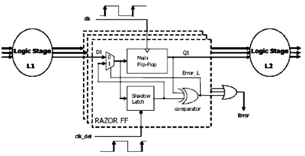{ height=50% }

::::
:::

[^dvfs-razor]: Hardware Level DVFS --- Section 3.5, Page 41.

----------------------------------------

If values do not match a fault is detected and corrected and voltage increases
else operation continues normally.

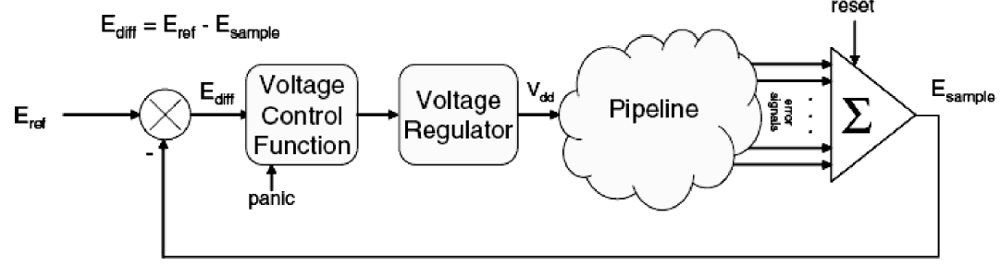{ height=50% }


#
##
### **`References`**

- [Stefanos Kaxiras; Margaret Martonosi, _Computer Architecture Techniques for Power-Efficiency_ , Morgan & Claypool, 2008.](https://ieeexplore.ieee.org/document/6812802)

### _**`EoF`**_

\begin{center}
\Huge \emph{ Thank You !}
\end{center}

\blfootnote{© 2022 Ceremorphic, Inc. All rights reserved. }


